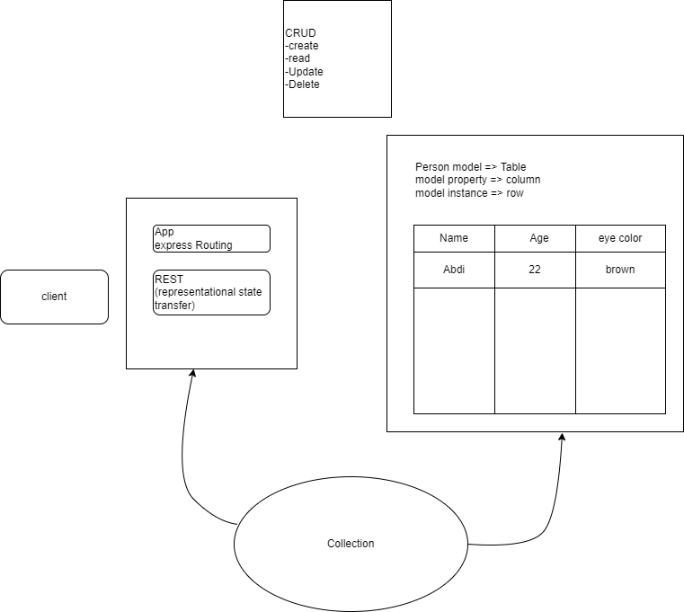

LAB - Express
========

Express Api
---------------

### Author: Abdinasir Yussuf

-   [tests report](https://github.com/codefellows/code-401-javascript-example-lab/actions)
-   [front-end](https://code-401-js-lab-example.herokuapp.com/status)

### Setup

#### `.env` requirements

-   `PORT` - Port Number

#### Running the app

-   `npm start`
-   Endpoint: `/person`
    -   Returns Object

        ```
        {
          'name': '<search Query>'
        }

        ```

#### Tests

-   Unit Tests: `npm test`


#### UML

